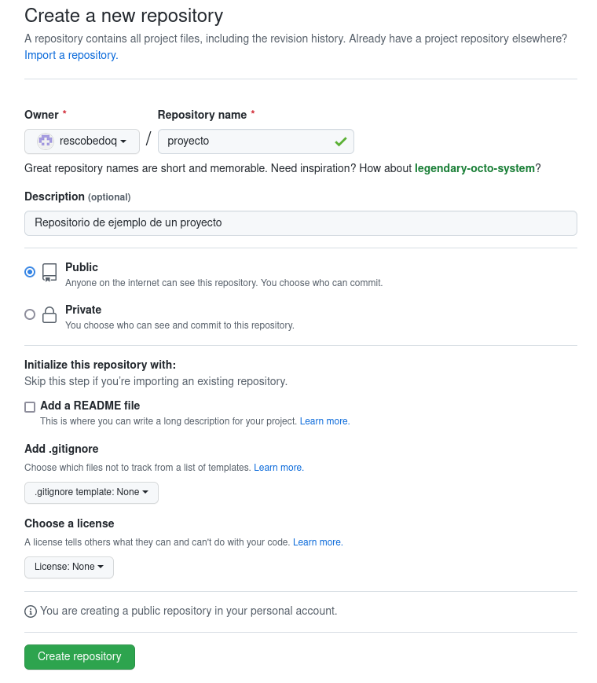
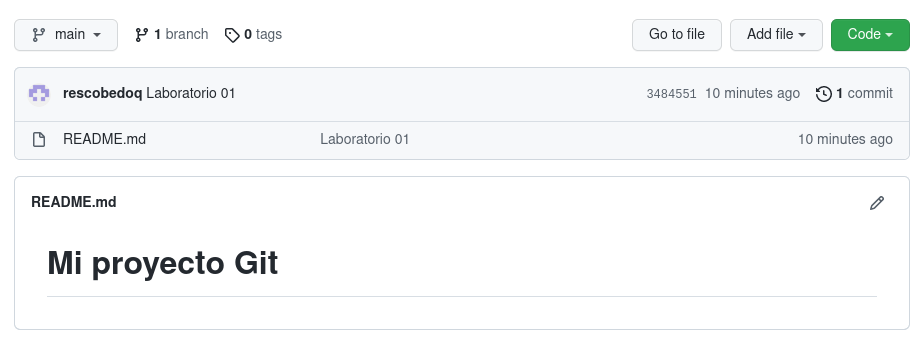

<div align="center">
<table>
    <theader>
        <tr>
            <td></td>
            <th>
                <span style="font-weight:bold;">UNIVERSIDAD LA SALLE</span><br />
                <span style="font-weight:bold;">FACULTAD DE INGENIERÍAS</span><br />
                <span style="font-weight:bold;">DEPARTAMENTO DE INGENIERÍA Y MATEMÁTICAS</span><br />
                <span style="font-weight:bold;">CARRERA PROFESIONAL DE INGENIERÍA DE SOFTWARE</span>
            </th>            
        </tr>
    </theader>
    <tbody>
        <tr><td colspan="2"><span style="font-weight:bold;">Formato</span>: Guía de Práctica de Laboratorio / Talleres / Centros de Simulación</td></tr>        
    </tbody>
</table>
</div>

<div align="center">
<span style="font-weight:bold;">GUÍA DE LABORATORIO</span><br />
</div>

<table>
<theader>
<tr><th colspan="2">INFORMACIÓN BÁSICA</th></tr>
</theader>
<tbody>

<tr><td>TÍTULO DE LA PRÁCTICA:</td><td>Git - GitHub</td></tr>
<tr><td colspan="2">RECURSOS A UTILIZAR:
<ul>
<li><a href="https://guides.github.com/">https://guides.github.com/</a></li>
<li><a href="https://git-scm.com/book/es/v2">https://git-scm.com/book/es/v2</a></li>
</ul>
</td>
</<tr>
<tr><td colspan="2">DOCENTES:
<ul>
<li>Richart Smith Escobedo Quispe (r.escobedo@ulasalle.edu.pe)</li>
</ul>
</td>
</<tr>
</tdbody>
</table>


# OBJETIVOS TEMAS Y COMPETENCIAS

## OBJETIVOS

- Aprender a manejar un sistema de control de versiones de manera colaborativa con varios
usuarios

## TEMAS
- Git
- GitHub

# CONTENIDO DE LA GUÍA

## MARCO CONCEPTUAL

- Instalar Git en el ordenador

	- GNU/Linux

	- MS Windows
		- Descargar Git-2.36.0-64-bit.exe desde https://git-scm.com/download/win

	- MacOS

- git init
    - Crea un nuevo proyecto local, se crean archivos en el directorio oculto .git
    ```sh
    git init
    ```

- git config
    - Establece variables de configuración. Por ejemplo para los commits se necesita los datos del desarrollador. Se puede especificar el editor y hasta el tiempo que deseas almacenar tus credenciales en la cache y otras cosas más
    ```sh
    git config --global user.name "Richart Smith Escobedo Quispe"
    git config --global user.email r.escobedo@ulasalle.edu.pe
    git config --list
    git config user.name
    git config --global core.editor "code --wait"
    git config --global credential.helper 'cache --timeout=3600'
    ```

- git status
    - Permite verificar el estado de los archivos
    ```sh
    git status
    ```
- git add
    - Añade archivos al staging area. El punto "." agrega todos
    ```sh
    git add HolaMundo.java
    git add .
    ```

- git commit
    - Sube los archivos al área de staging, en la máquina local. La opción -m permite escribir el mensaje en línea
    ```sh
    git commit -m "Probando el Hola Mundo"    
    ```

- git clone
    - Clona un repositorio remoto como un repositorio local, en el cual se puede hacer push
    ```sh
    git clone https://github.com/rescobedoulasalle/test.git
    ```

- git remote
    - Persigue un repositorio remoto para hacer push.
    ```sh
    git remote add origin https://github.com/rescobedoulasalle/test.git
    ```

- git push
    - Permite subir archivos al repositorio remoto
    ```sh
    git push -u origin main    
    ```

- git show
    - Muestra detalles del commit actual
    ```sh
    git show
    ```

-   git log
    - Permite ver un resumen de los commit realizados
    ```sh
    git log
    git log --pretty=oneline
    git log --graph --pretty=oneline --abbrev-commit --all
    git log --pretty=format:"%h - %an, %ar : %s"
    git log -p -2
    ```
    <pre>
    6bb6b6e - Richart Escobedo Quispe, hace 3 minutos : Git - GitHub
    6bb6b6e - Richart Escobedo Quispe, hace 12 minutos : Git - GitHub
    b36a9fd - Richart Escobedo Quispe, hace 14 minutos : Git - GitHub
    e86aac8 - Richart Escobedo Quispe, hace 22 minutos : Git - GitHub
    e58f653 - Richart Escobedo Quispe, hace 31 minutos : first commit
    5747062 - Richart Escobedo Quispe, hace 35 minutos : first commit
    </pre>

- git diff
    - Permite comparar los cambios en los archivos
    ```sh
    git diff 6bb6b6e 6bb6b6e
    ```

- git branch
    - Permite ver las ramas existentes o crea una rama alternativa al proyecto principal git branch -a
    ```sh
    git branch prueba1
    git branch
    ```
    <pre>
    * main
    prueba1
    </pre>

- git checkout
    - Permite regresar a versiones anteriores o saltar a otra rama
    ```sh
    git checkout prueba1
	git branch
    ```
    <pre>
    main
    * prueba1
    </pre>


- git pull
    - Permite descargar los cambios del repositorio remoto al directorio local


## EJERCICIO/PROBLEMA RESUELTO POR EL DOCENTE
Primer repositorio en GitHub
- Creamos un nuevo proyecto en GitHub
    - 

- Crearemos un repositorio local usando git init
    ```sh
    pwd
    /home/richart/ulasalle/proyecto
    git init
    ```

- Crearemos un archivo Readme.md con contenido Markup
    ```sh
    echo "# Mi proyecto Git" > README.md
    ```

- Agregaremos este archivo al staging area usando git add .
    ```sh
    git status
    ```
    <pre>
    En la rama main

    No hay commits todavía

    Archivos sin seguimiento:
    (usa "git add <archivo>..." para incluirlo a lo que se será confirmado)
	README.md
    no hay nada agregado al commit pero hay archivos sin seguimiento presentes (usa "git add" para hacerles seguimiento)
    </pre>
    ```sh
    git add README.md
    ```

- Hacemos un primer commit en nuestro repositorio local 
    ```sh
    git commit -m "Mi primer proyecto en github"
    ```
- Asociamos el repositorio local con el repositorio remoto 
    ```sh
    git remote add origin https://github.com/rescobedoulasalle/test.git
    ```

- Actualizamos el repositorio remoto
    ```sh
    git push -u origin main
    ```

- Ahora podemos verificar en GitHub que nuestro repositorio se actualizó con el proyecto local
    - 

- Cree una clase Java HolaMundo.java que imprima un saludo, compílelo, ignore archivos binarios, agregue archivo al stating area, haga commit y súbalo al repositorio GitHub.
    ```sh
    vim HolaMundo.java
    ```
    <pre>
    public class HolaMundo
    {
        public static void main(String args[]) {
        
            /** */
            System.out.println ("¡Hola mundo!");

        }
    }
    </pre>
    ```sh    
    java -version
    ```
    <pre>
    openjdk version "11.0.14" 2022-01-18
    </pre>
    ```sh
    javac HolaMundo.java
    java HolaMundo
    ```
    <pre>
    ¡Hola mundo!
    </pre>
    ```sh
    vim .gitignore
    ```
    <pre>
    *.class
    .gitignore
    </pre>
    ```sh
    git add HolaMundo.java
    git commit -m "Hola Mundo"
    git push -u origin main
    ```
    
## EJERCICIOS/PROBLEMAS PROPUESTOS
- Cree una cuenta de usuario en github.
- Configure su cuenta de estudiante (https://education.github.com/pack).
- Cree un nuevo proyecto personal y desarrolle el ejercicio resuelto en clase. Haga 3 commits y muestre los 3 últimos.
- Cree un proyecto grupal para resolver el siguiente problema: Se desea crear una clase Calculator en Java, que tenga las siguientes operaciones: add, sub, mul, div, mod; estas operaciones recibirán dos enteros y devolverán un entero. (Forme grupos de 3 a 5 personas). Cree ramas para cada integrante y cada cierto tiempo una las ramas al main.

## CUESTIONARIO
- ¿Por qué Git es una herramienta importante en el curso?
- ¿Qué conductas éticas debe promocionarse cuando se usa un Sistema de Control de Versiones?
- ¿Qué son los entándares de codificación?

## REFERENCIAS Y BIBLIOGRÁFIA RECOMENDADAS
- https://guides.github.com/
- https://git-scm.com/book/es/v2


